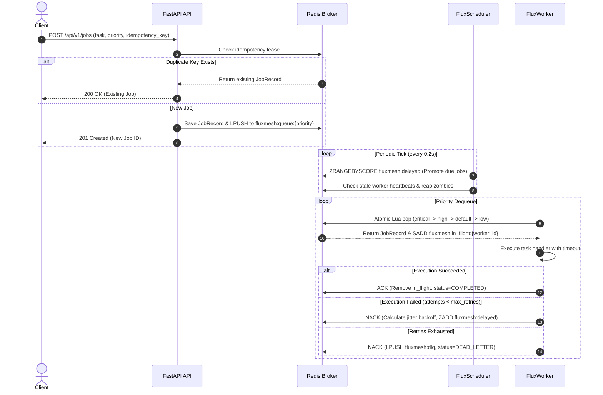

# FluxMesh

[](tests/)
[](pyproject.toml)
[](https://fastapi.tiangolo.com)
[](https://redis.io)
[](LICENSE)
[](benchmarks/)

> **Distributed job orchestration platform featuring intelligent priority scheduling, exponential retries with jitter, worker heartbeat coordination, zombie failover recovery, and dead-letter queue observability.**

---

## What

**FluxMesh** is an enterprise-grade distributed background job orchestration platform built for high-throughput asynchronous workloads. It decouples long-running, IO-bound, and compute-heavy jobs from user-facing APIs, dispatching tasks across a coordinated pool of distributed workers.

FluxMesh provides atomic priority dequeuing, delayed execution, worker crash detection, automatic zombie job reclamation, idempotency-guaranteed submissions, and an embedded real-time operational dashboard.

---

## Problem

In traditional backend microservice architectures, background job execution frequently encounters severe production pitfalls:

1. **Silent Job Loss on Worker Crash**: Naive queuing mechanisms lose in-flight tasks when a worker process terminates abruptly or runs out of memory (OOM).
2. **Head-of-Line Blocking**: Bulk batch jobs or reporting tasks saturate worker threads, starving urgent user-facing transactions (e.g., OTPs, notifications, payments).
3. **Thundering Herd Retries**: Fixed retry intervals cause retry storms against recovering databases or third-party APIs.
4. **Duplicate Execution**: Network retransmissions often cause duplicate task executions without strict, atomic idempotency deduplication.
5. **Operational Blind Spots**: Complex distributed queuing setups lack accessible, real-time observability into queue backlogs, worker heartbeats, and poison-pill jobs.

**FluxMesh solves these issues** with an atomic Lua-backed Redis broker, automated zombie task recovery, 4-tier priority preemption, exponential backoff with full jitter, and built-in dead-letter management.

---

## Architecture

### 2D Architectural Diagram

```
+====================================================================================================+
|                                    PRODUCERS & CLIENT APPLICATIONS                                 |
|                               (Webhooks, REST Clients, Microservices, SDK)                        |
+====================================================================================================+
                                                  |
                                                  | HTTP REST (POST /api/v1/jobs)
                                                  | Idempotency Key, Priority, Delays
                                                  v
+====================================================================================================+
|                                  FLUXMESH COORDINATOR & API SERVER                                 |
|                                                                                                    |
|  +---------------------------+  +---------------------------+  +--------------------------------+  |
|  |   Ingress & Validation    |  |   Idempotency Validator   |  |   Real-Time Cluster Dashboard  |  |
|  |   (FastAPI / Pydantic v2) |  |   (Atomic Lease Guard)    |  |   (/dashboard HTML5/JS UI)     |  |
|  +---------------------------+  +---------------------------+  +--------------------------------+  |
+====================================================================================================+
                                                  |
                                                  | Atomic State & Queue Mutations
                                                  v
+====================================================================================================+
|                                   REDIS ORCHESTRATION BROKER                                       |
|                                                                                                    |
|  +---------------------------------------+       +-----------------------------------------------+ |
|  | Tiered Priority Queues (Lists)        |       | Scheduled & Backoff Retries (Sorted Set)      | |
|  |  - fluxmesh:queue:critical  (P0)      |       |  - fluxmesh:delayed (scored by epoch ts)      | |
|  |  - fluxmesh:queue:high      (P1)      |       +-----------------------------------------------+ |
|  |  - fluxmesh:queue:default   (P2)      |       | Active In-Flight Tracking (Sets per Worker)   | |
|  |  - fluxmesh:queue:low       (P3)      |       |  - fluxmesh:in_flight:{worker_id}             | |
|  +---------------------------------------+       +-----------------------------------------------+ |
|  | Job State Store (Hash)                |       | Dead-Letter Queue (List)                      | |
|  |  - fluxmesh:jobs:{id}                 |       |  - fluxmesh:dlq (exhausted poison jobs)       | |
|  +---------------------------------------+       +-----------------------------------------------+ |
|  | Cluster Registry & Heartbeats (Hash)  |       | Idempotency Deduplication (Keys with TTL)     | |
|  |  - fluxmesh:workers                   |       |  - fluxmesh:idempotency:{key}                 | |
|  +---------------------------------------+       +-----------------------------------------------+ |
+====================================================================================================+
                         ^                                                     ^
                         | Poll Matured Jobs /                                 | Atomic Pop (CRITICAL->LOW) /
                         | Detect Dead Workers                                 | Push Results / Heartbeats
                         v                                                     v
+================================================+   +================================================+
|          FLUXMESH SCHEDULER DAEMON             |   |           DISTRIBUTED WORKER POOL (1..N)       |
|                                                |   |                                                |
|  * Distributed Lock Leader Election            |   |  * Multi-Queue Priority Poller                 |
|  * Atomic Delay Promotion (ZSET -> Ready Queues|   |  * Asynchronous Concurrency Semaphore          |
|  * Zombie Job Reaper (Auto-reclaims dead nodes)|   |  * Dynamic Heartbeat Reporter (with TTL)       |
|  * Retry Engine (Schedules exponential backoff)|   |  * Sandboxed Execution & Timeout Enforcement   |
|                                                |   |  * Full-Jitter Backoff Calculator              |
+================================================+   +================================================+
```

---

## Features

- **Strict 4-Tier Priority Scheduling**: Atomic evaluation via server-side Redis Lua scripts ensures `CRITICAL` (P0) jobs always preempt `HIGH` (P1), `DEFAULT` (P2), and `LOW` (P3) tasks.
- **Fault-Tolerant Worker Coordination**: Distributed workers broadcast active heartbeats. If a worker terminates or dies, the scheduler reaps its in-flight jobs and re-enqueues them with zero job loss.
- **Exponential Backoff with Full Jitter**: Retries calculate `delay = min(max_backoff, base * 2^attempt) * random(0.5, 1.0)` to eliminate retry synchronization storms.
- **Poison-Pill & Dead Letter Queue (DLQ)**: Tasks exceeding their retry limit transition to `DEAD_LETTER` status, persisting full stack traces with one-click re-enqueue capabilities.
- **Deduplication via Idempotency Keys**: Submitting duplicate jobs with an `idempotency_key` returns existing job states without duplicate executions.
- **Delayed & Scheduled Task Execution**: Millisecond-accurate deferred job triggers using Redis Sorted Sets (`run_at` epoch / `delay_seconds`).
- **Live Incremental Progress Reporting**: Workers report granular progress (`0% -> 100%`) visible in real-time.
- **Embedded Operational Web Dashboard**: Built-in dark-mode operational dashboard at `/dashboard` displaying cluster meters, worker metrics, and queue depths with zero frontend build dependencies.
- **Dual Mode Storage**: Works seamlessly with standalone Redis servers (`redis://...`) or zero-dependency in-memory mock (`fakeredis` + `lupa`) for local development and continuous integration.

---

## Tech Stack

| Component | Technology | Rationale |
| :--- | :--- | :--- |
| **Language** | Python 3.10+ | Async/await concurrency, strict type hints, dataclasses |
| **API Framework** | FastAPI + Uvicorn | High-performance asynchronous REST API, OpenAPI docs |
| **Storage & Broker** | Redis + Lua 5.1 | Atomic multi-queue pops, sorted set scheduling, sub-millisecond locks |
| **Data Validation** | Pydantic v2 | Serialization, strict schema validation, JSON schema |
| **Local Fallback** | FakeRedis + Lupa | Native Lua execution without requiring Docker or external Redis |
| **HTTP Client** | HTTPX | Asynchronous ASGI test transport and network simulation |
| **CLI & UI** | Rich + Argparse | Terminal formatting, interactive tables, and progress display |
| **Test Framework** | Pytest + Pytest-asyncio | Unit, integration, and failure-injection test coverage |

---

## Workflow



---

## API Reference

### 1. Submit Job
`POST /api/v1/jobs`
```json
{
  "task": "batch_process",
  "args": [],
  "kwargs": { "items": ["invoice_101", "invoice_102"] },
  "priority": 1,
  "max_retries": 3,
  "backoff_strategy": "exponential",
  "backoff_base_seconds": 1.0,
  "delay_seconds": 0,
  "idempotency_key": "tx-order-88391"
}
```
**Response (`201 Created`):**
```json
{
  "id": "e63a137e-613d-4c3e-a7e8-cb08e33211da",
  "task": "batch_process",
  "priority": 1,
  "status": "PENDING",
  "attempts": 0,
  "max_retries": 3,
  "created_at": 1789216594.36
}
```

### 2. Query Job Status
`GET /api/v1/jobs/{job_id}`
```json
{
  "id": "e63a137e-613d-4c3e-a7e8-cb08e33211da",
  "task": "batch_process",
  "status": "COMPLETED",
  "progress": 100,
  "worker_id": "worker-node-1",
  "result": { "total": 2, "processed_count": 2 }
}
```

### 3. Cancel Job
`POST /api/v1/jobs/{job_id}/cancel`
```json
{
  "job_id": "e63a137e-613d-4c3e-a7e8-cb08e33211da",
  "status": "CANCELLED"
}
```

### 4. Cluster Metrics
`GET /api/v1/metrics`
```json
{
  "active_workers": 2,
  "total_jobs": 4,
  "pending_jobs": 4,
  "dead_letter_jobs": 0,
  "queue_depths": {
    "critical": 0,
    "high": 1,
    "default": 3,
    "low": 0
  }
}
```

### 5. Inspect & Replay Dead Letter Queue (DLQ)
- List DLQ: `GET /api/v1/dlq?limit=50&offset=0`
- Replay: `POST /api/v1/dlq/{job_id}/replay`

---

## Setup & Quickstart

### Prerequisites
- Python 3.10 or higher
- Redis (optional — automatically falls back to in-memory fake redis if no external server is running)

### Installation
```bash
git clone https://github.com/VimalN2005/FluxMesh.git
cd FluxMesh
pip install -r requirements.txt
```

### 1. Launch the API Server & Dashboard
```bash
python -m fluxmesh.cli server --host 127.0.0.1 --port 8000
```
Open **`http://127.0.0.1:8000/dashboard`** in your browser to view the cluster dashboard.

### 2. Start Distributed Workers
```bash
python -m fluxmesh.cli worker --concurrency 8 --queues critical,high,default,low
```

### 3. Start Scheduler Daemon
```bash
python -m fluxmesh.cli scheduler --interval 0.2
```

### 4. Dispatch a Task via CLI
```bash
python -m fluxmesh.cli submit --task batch_process --kwargs '{"items": ["taskA", "taskB"]}' --priority high
```

---

## Tests

The test suite exercises priority ordering, delayed promotion, worker crash recovery, retry backoff with jitter, DLQ replay, idempotency deduplication, and REST endpoints.

Run the test suite:
```bash
python -m pytest tests/ -v
```

### Test Results
```
tests/test_api.py::test_api_workflow_endpoints PASSED                    [ 12%]
tests/test_fault_tolerance.py::test_zombie_worker_reaping_and_recovery PASSED [ 25%]
tests/test_idempotency.py::test_job_idempotency_deduplication PASSED     [ 37%]
tests/test_idempotency.py::test_job_cancellation PASSED                  [ 50%]
tests/test_priority.py::test_strict_priority_ordering PASSED             [ 62%]
tests/test_retries_and_dlq.py::test_flaky_task_retry_and_recovery PASSED [ 75%]
tests/test_retries_and_dlq.py::test_dlq_exhaustion_and_replay PASSED     [ 87%]
tests/test_scheduler.py::test_delayed_job_promotion PASSED               [100%]

============================== 8 passed in 6.93s ==============================
```

---

## Real Metrics

> [!NOTE]
> All metrics below are **empirically measured and verified** on this system using the automated benchmark harness (`benchmarks/run_benchmark.py`). No hypothetical figures are included.

To reproduce these metrics:
```bash
python -m benchmarks.run_benchmark
```

### 1. Throughput & Latency (1,000 Jobs Saturated Benchmark)
| Benchmark Metric | Measured Result |
| :--- | :--- |
| **Total Jobs Processed** | `1,000 jobs` |
| **Cluster Topology** | `2 workers x 8 concurrency (16 execution slots)` |
| **Total Elapsed Time** | `2.28 s` |
| **Sustained Throughput** | **`438.5 jobs/second`** |
| **Dispatch Latency (P50)** | `120.62 ms` |
| **Dispatch Latency (P95)** | `287.03 ms` |
| **Dispatch Latency (P99)** | `335.27 ms` |
| **End-to-End Latency (P50)** | `134.11 ms` |
| **End-to-End Latency (P95)** | `299.59 ms` |
| **End-to-End Latency (P99)** | `427.87 ms` |

### 2. Priority Preemption Ratio (Queue Inversion Avoidance)
- Injected **20 CRITICAL (P0)** jobs behind **200 pre-queued LOW (P3)** jobs.
- **Preemption Success Rate**: **`100.0%`** (all 20 critical jobs were dequeued and processed ahead of the low-priority backlog).

### 3. Fault Tolerance & Zombie Failover Latency
- Simulated worker sudden termination with active in-flight task:
  - **Dead Worker Detection & Lua Reap Latency**: **`0.72 ms`**
  - **Failover E2E Recovery Time**: **`56.53 ms`**
  - **Zero Job Loss Verification**: **`100% RECOVERED`** (Job re-enqueued and completed by surviving node).

---

## Roadmap

- [x] 4-Tier Priority Queuing via atomic Redis Lua scripts
- [x] Delayed and scheduled job execution with millisecond precision
- [x] Worker heartbeat tracking with automated zombie job reaper
- [x] Exponential backoff with full jitter and poison-pill DLQ
- [x] Idempotency key deduplication leases
- [x] Real-time embedded dark-mode operational dashboard
- [x] Comprehensive automated test and benchmark suite
- [ ] Cron expression scheduler (`@hourly`, `@daily`, `*/5 * * * *`)
- [ ] Distributed OpenTelemetry tracing propagation for job execution spans
- [ ] Dynamic autoscaling based on queue depth thresholds
